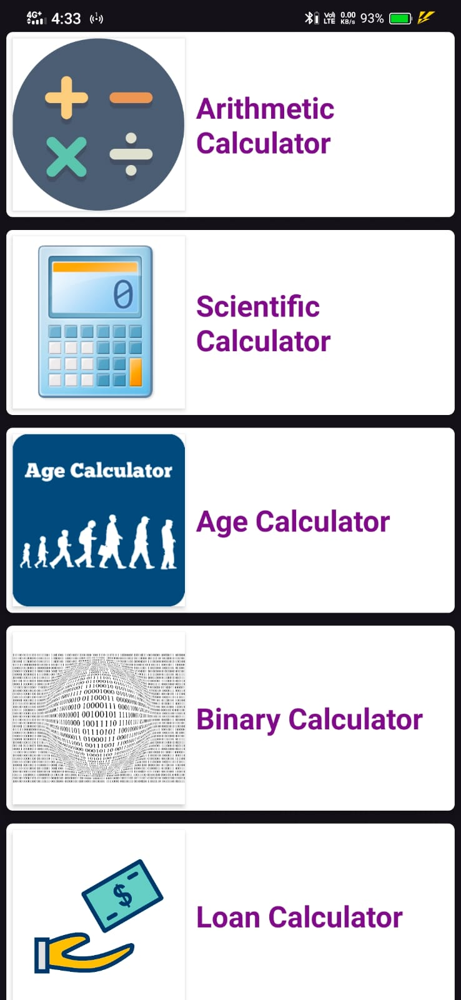
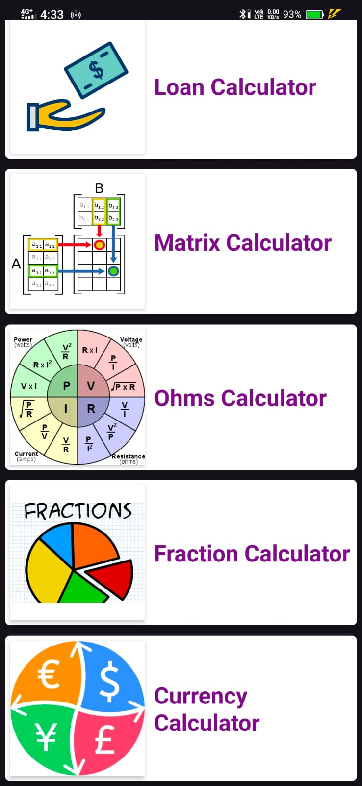
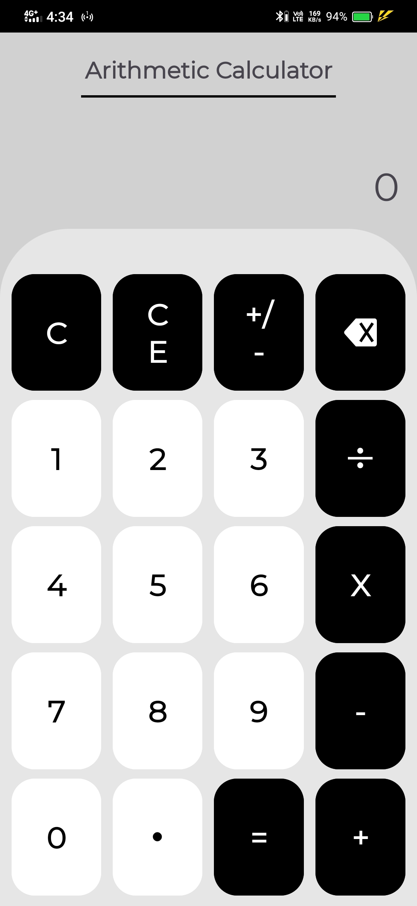
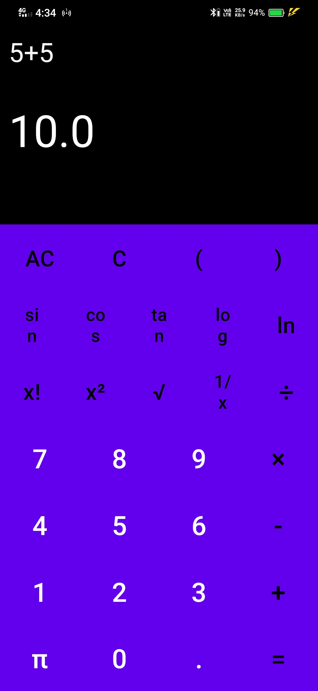
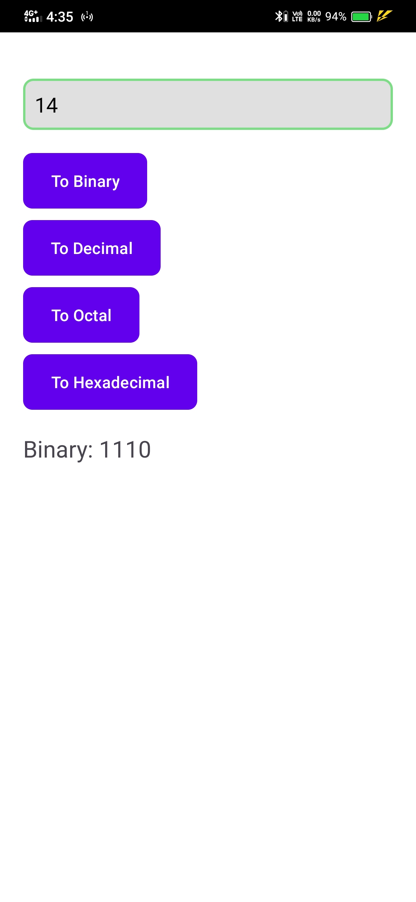

# Super Calculator 📱

An Android calculator application developed using Java in Android Studio.

## Features
- Arithmetic Calculator
- Scientific Calculator
- Age Calculator
- Binary Calculator
- Loan Calculator
- Matrix Calculator
- Ohms Calculator
- Fraction Calculator
- Currency Calculator

## Tech Stack
- Java
- Android Studio
- XML

## Note
The original source code was lost after system reset/uninstall, but the APK build and app functionality are preserved.

## Screenshots

